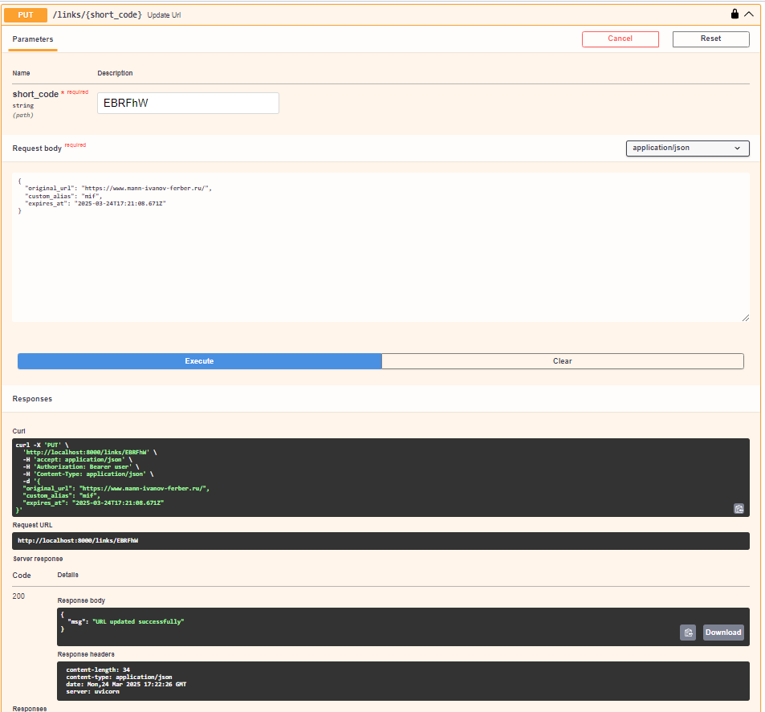
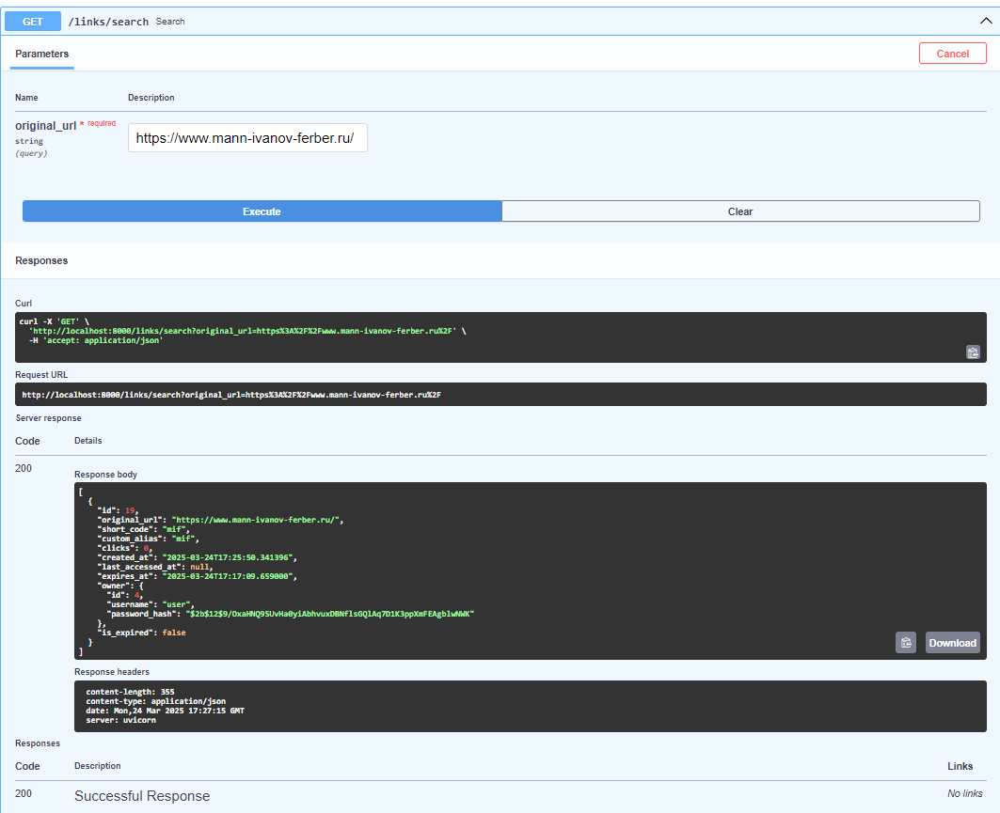

## Описание сервиса

Этот сервис предоставляет функциональность для сокращения URL-адресов, управления ими, а также включает механизмы аутентификации и авторизации. Он использует базу данных PostgreSQL для хранения информации о пользователях и URL-ах, а также кэширование в Redis для повышения производительности. Идейно мной был переработан [аналогичный проект пользователя TorhamDev](https://github.com/TorhamDev/link-Shortener-FastAPI/tree/main).

## Эндпоинты сервиса

### Регистрация пользователя
- **POST /register**


  Регистрация новых пользователей. Требуется указать уникальное имя пользователя и пароль. Возвращает сообщение об успешной регистрации.

  **Параметры:**
  - `username`: имя пользователя
  - `password`: пароль

### Аутентификация пользователя
- **POST /token**


  Аутентификация пользователя и получение токена доступа. Используется схема OAuth2 с использованием bearer токена.

  **Параметры:**
  - `username`: имя пользователя
  - `password`: пароль

### Авторизация пользователя


### Сокращение URL
- **POST /links/shorten**


  Создание сокращенной версии предоставленного URL. Поддерживает создание пользовательских алиасов и сроков действия. Необходим токен для идентификации владельца ссылки.

  **Параметры:**
  - `original_url`: оригинальный URL, который нужно укоротить
  - `custom_alias`: пользовательский алиас (опционально)
  - `expires_at`: дата истечения срока действия (опционально)

### Редирект по короткой ссылке
- **GET /{short_code}**


  Перенаправление пользователя на оригинальный URL по предоставленному короткому коду. Если `reveal=True`, возвращается оригинальный URL без редиректа.

  **Параметры:**
  - `short_code`: код, указывающий на сокращенную ссылку
  - `reveal`: если True, возвращает оригинальный URL без редиректа (опционально)

### Обновление ссылки
- **PUT /links/{short_code}**


  Обновление информации о сокращенной ссылке. Необходим токен для аутентификации владельца.

  **Параметры:**
  - `short_code`: код сокращенной ссылки
  - `original_url`: новый оригинальный URL (опционально)
  - `custom_alias`: новый пользовательский алиас (опционально)
  - `expires_at`: новая дата истечения срока действия (опционально)

### Удаление ссылки
- **DELETE /links/{short_code}**


  Удаление сокращенной ссылки. Необходим токен для аутентификации владельца.

  **Параметры:**
  - `short_code`: код сокращенной ссылки

### Статистика по ссылке
- **GET /links/{short_code}/stats**


  Получение статистики по сокращенной ссылке, включая количество кликов и даты создания и последнего доступа.

  **Параметры:**
  - `short_code`: код сокращенной ссылки

### Поиск по оригинальной ссылке
- **GET /links/search**


  Поиск всех сокращенных ссылок по оригинальному URL.

  **Параметры:**
  - `original_url`: оригинальный URL для поиска

### Получение всех ссылок пользователя
- **GET /links/user**


  Получение всех созданных ссылок для аутентифицированного пользователя.

  **Параметры:**
  - `token`: токен для аутентификации пользователя

### Удаление устаревших ссылок
- **Startup Event**

  Автоматическое удаление устаревших ссылок при запуске сервера.

### Просмотр истории всех истекших ссылок
- **GET /expired_links**


  Получение всех ссылок, срок действия которых истек.

### Корень сервиса
- **GET /**


  Рендеринг основной страницы сервиса с помощью шаблона.

### Административная панель
- **GET /admin/**


  Административная панель с информацией о пользователях и ссылках. Информация включает общее количество пользователей, количество закэшированных URL и последние 10 созданных ссылок.

### Тестирование в Postman


  Проверка работоспособности сервиса в том числе выполнялась при помощи Postman.

## Инструкция по запуску проекта

Следуйте шагам ниже, чтобы развернуть и запустить проект локально с использованием Docker и Docker Compose.

1. Убедитесь, что у вас установлены Docker и Docker Compose. Проверить установку можно, выполнив команды:
   ```bash
   docker --version
   docker-compose --version

2. Клонируйте этот репозиторий на локальную машину:
   ```bash
   git clone https://github.com/your-username/your-repo-name.git
   cd your-repo-name
   ```

3. Создайте файл `.env` в корне проекта и добавьте следующие переменные окружения:
   ```
   POSTGRES_USER=your_postgres_user
   POSTGRES_PASSWORD=your_postgres_password
   POSTGRES_DB=your_postgres_db
   ```
Запуск проекта1. В корне проекта выполните команду для сборки и запуска контейнеров:
   ```bash
   docker-compose up --build
   ```

   Эта команда:
   - Сконфигурирует и создаст образы для каждого сервиса, определенного в `docker-compose.yml`.
   - Запустит все контейнеры в соответствии с настройками.

2. После запуска, FastAPI приложение будет доступно по адресу: [http://localhost:8000](http://localhost:8000).

3. Вы можете получить доступ к документации API, сгенерированной автоматически, по адресу:
   - [Swagger UI](http://localhost:8000/docs)
   - [ReDoc](http://localhost:8000/redoc)
Завершение работы
Чтобы остановить все запущенные контейнеры, выполните:
docker-compose down

Теперь ваш проект готов к работе, и вы можете использовать Docker и Docker Compose для его управления и развертывания.

## Структура базы данных

Проект использует реляционную базу данных для хранения информации о пользователях и сокращенных URL. Ниже представлены таблицы и их основные поля.

### Таблица User

Хранит информацию о зарегистрированных пользователях.

- `username` (CharField): Имя пользователя, уникальное для каждого пользователя.
- `password_hash` (CharField): Захешированный пароль пользователя для безопасного хранения.
- Метод `verify_password`: Метод для проверки введенного пароля по сравнению с захешированным.

### Таблица URL

Содержит данные о сокращенных URL.

- `original_url` (CharField): Оригинальный URL, который будет сокращен.
- `short_code` (CharField, уникальное): Уникальный короткий код, используемый для представления сокращенного URL.
- `custom_alias` (CharField, может быть NULL, уникальное): Пользовательские алиасы, если они были заданы пользователями.
- `clicks` (IntegerField): Количество кликов по сокращенному URL.
- `created_at` (DateTimeField): Время создания сокращенного URL.
- `last_accessed_at` (DateTimeField, может быть NULL): Время последнего доступа к URL.
- `expires_at` (DateTimeField, может быть NULL): Время истечения срока действия URL.
- `owner` (ForeignKeyField на User, может быть NULL): Ссылка на владельца URL. Связь между URL и пользователем.
- `is_expired` (BooleanField): Поле для отметки истекших ссылок.
- Метод `mark_expired`: Метод для пометки URL как истекшего.

### Связи

- **User** имеет "один-ко-многим" связь с таблицей **URL**, где каждый пользователь может иметь несколько URL, но каждый URL принадлежит только одному пользователю.

Эти таблицы и поля позволяют системе управлять пользователями и сокращенными ссылками, обеспечивая необходимую функциональность для созранения и управления URL с возможностью учета срока действия, а также мониторинг количества просмотров каждого URL.