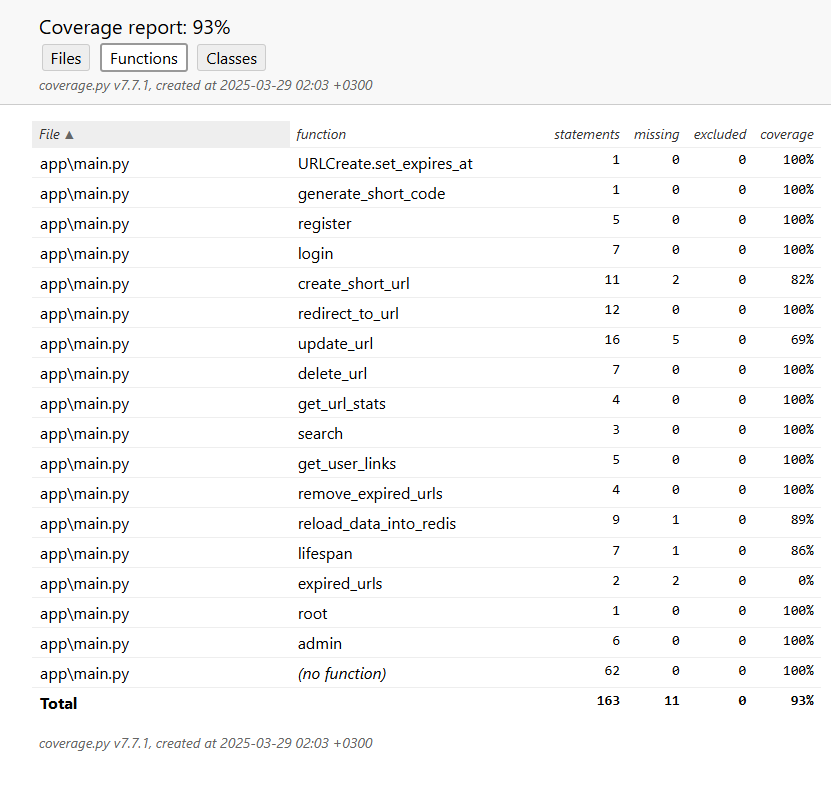
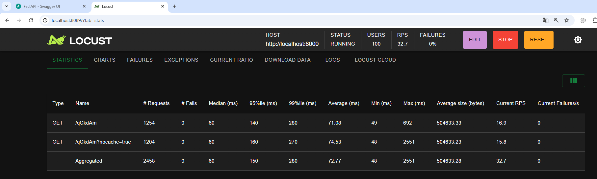

# Тестирование FastAPI приложения

Этот документ описывает тесты, написанные для приложения, а также объясняет их назначение и структуру.

## Общая структура тестов

Тесты написаны с использованием библиотеки `pytest` и охватывают основные функциональности, такие как регистрация пользователей, аутентификация, управление короткими URL, и взаимодействие с Redis. Для упрощения тестирования дополнительных зависимостей используются моки из `unittest.mock`.

## Настройка тестовой среды

Для запуска проекта в тестовом режиме с использованием SQLite в качестве базы данных, выполните следующие шаги:

### 1. Установите зависимости

Убедитесь, что в проекте установлены все необходимые зависимости:

````bash
pip install -r requirements.txt
````

### 2. Создайте файл .env

Создайте .env - файл в корне вашего проекта. В этом файле нужно указать следующие переменные окружения для настройки тестовой базы данных:

````bash
SQLITE_TEST_DB=test_database.db
````
### 3. Запустите проект в тестовом режиме

Запустите ваш проект, указав переменную окружения ENV в значение testing. Это можно сделать несколькими способами в зависимости от вашей среды разработки или операционной системы.
Через командную строку (Linux/MacOS)

````bash
export ENV=testing
python main.py
````

Через командную строку (Windows)

````bash
set ENV=testing
python main.py
````

Ваш проект теперь будет работать с SQLite базой данных, используя файлы, указанные в переменной окружения
SQLITE_TEST_DB. Это позволяет вам безопасно разрабатывать и тестировать функции без изменения данных в основной PostgreSQL базе данных.

`SQLITE_TEST_DB` по умолчанию будет использовать `test_database.db`, если вы ничего не укажете.

Теперь вы готовы использовать свой проект в тестовом режиме!

## Обзор тестов

### Конфигурация тестирования

Перед выполнением тестов, база данных настраивается и инициализируется таблицами `User` и `URL` через фикстуру `setup_teardown_db`. Эта фикстура отвечает за создание и удаление таблиц перед и после тестов, что гарантирует, что каждый тест запускается в "чистом" состоянии.

### Тесты регистрации и аутентификации

1. **Регистрация нового пользователя**

   `test_register_new_user`: Проверяет успешную регистрацию нового пользователя и обработку попытки зарегистрировать пользователя с уже существующим именем.

2. **Аутентификация пользователя**

   `test_login`: Проверяет различные сценарии входа в систему, включая успешный вход и ошибки при вводе неверных учетных данных.

### Управление короткими URL

1. **Создание и удаление короткого URL**

   - `test_create_short_url`: Проверяет создание коротких URL через API.
   - `test_delete_url_success`: Проверяет успешное удаление существующего URL.

2. **Обновление короткого URL**

   - `test_update_url_success`: Проверяет обновление оригинального URL, связанного с существующим коротким URL.
   - `test_update_url_fail_no_permission`: Проверяет, что невозможно изменить URL без соответствующих прав.

3. **Редиректы и информация о ссылках**

   - `test_redirect_to_url`: Проверяет корректность действий при редиректе по короткой ссылке с указанными условиями.
   - `test_get_url_stats`: Проверяет получение статистики кликов по сокращенной ссылке.

### Взаимодействие с Redis

1. **Кэширование данных**

   `test_reload_data_into_redis`: Проверяет корректность загрузки данных из базы данных в Redis.

2. **Удаление устаревших URL**

   `test_remove_expired_urls`: Проверяет удаление устаревших URL из базы данных и Redis.

### Дополнительные сценарии

1. **Поиск**

   `test_search_links`: Проверяет поиск ссылок в базе данных по оригинальным URL.

2. **Шаблоны**

   - `test_root_template`: Проверяет рендеринг главной страницы.
   - `test_admin_template`: Проверяет рендеринг административной страницы.

3. **Обработка ошибок**

   - `test_get_current_user_invalid_token`: Проверяет обработку неверного токена аутентификации.

### Асинхронные операции

Тесты, такие как `test_lifespan_exception`, проверяют сценарии, когда возникают ошибки при асинхронных операциях во время жизненного цикла FastAPI приложения.

## Запуск тестов

1. Установите зависимости.

2. Запустите тесты, используя команду:
````sh
   pytest --cov=app.main tests -v
````

## Отчёт о покрытии



[Отчёт о покрытии сохранён в HTML-формате.](htmlcov/index.html)

## Нагрузочное тестирование

Нагрузочное тестирование проводилось с использованием инструмента Locust. Было определено два сценария нагрузки:

1. **Сценарий с кешированием**: Запросы выполнялись с использованием короткого кода сгенерированного сервисом, что позволяло оценить производительность при использовании кеша.

2. **Сценарий без кеширования**: Запросы выполнялись с добавлением параметра `?nocache=true` к короткому коду, чтобы проанализировать отклик системы при обходе кеша.



В результате проведённого теста, видно, что при кэшировании сервис успевает обработать большее количество запросов за то же время. А максимальное время отклика без кэша в 4 раза превышает максимальное время ответа с кэшированием.